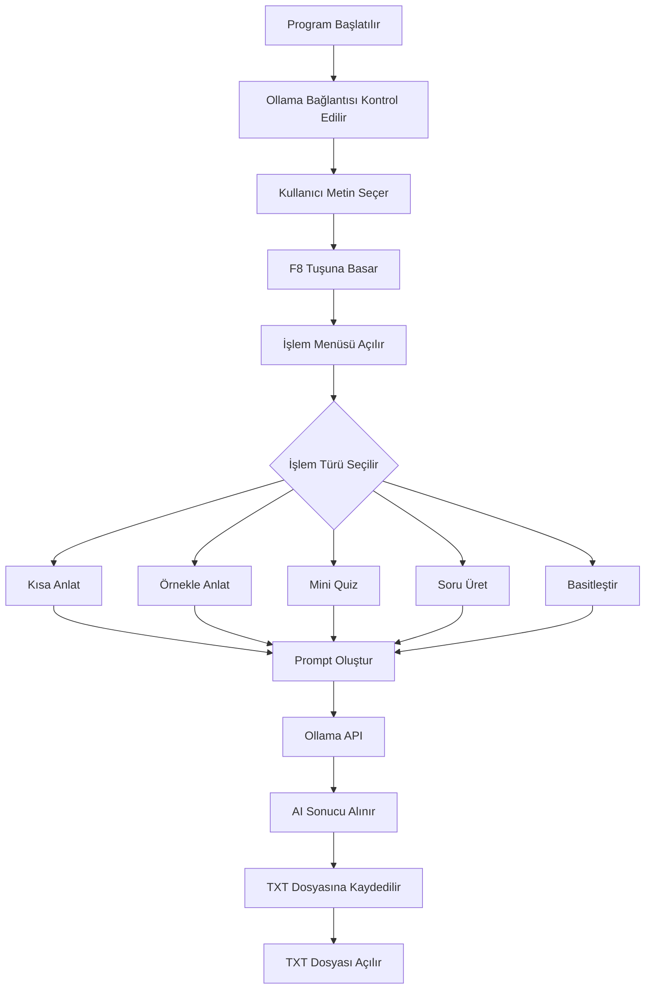

## Öğrenci Bilgileri

Ad Soyad: Dilara Özdemir  
Okul Numarası: 230205074  
Ders: Veri Görselleştirmeye Giriş

# AI Asistan - Metin İşleme Uygulaması

Bu proje, Ollama API üzerinden çalışan bir yapay zeka destekli metin işleme uygulamasıdır. Kullanıcı seçtiği bir metni F8 kısayolu ile yapay zekaya gönderebilir ve farklı işlemler uygulayabilir.

## Yapılan Geliştirmeler

Bu projede mevcut yapı bozulmadan yeni eğitim odaklı özellikler eklenmiştir.

Eklenen yeni özellikler:

- Kısa Anlat
- Örnekle Anlat
- Mini Quiz Oluştur
- Soru Üret
- Basitleştir

Ayrıca bu uzun eğitim çıktılarının seçili metnin üzerine yazılması yerine yeni bir `.txt` dosyasında açılması sağlanmıştır.

## Eklenen Özelliklerin Açıklaması

### Kısa Anlat
Seçilen konuyu kısa, sade ve öğrenci seviyesinde açıklar.

### Örnekle Anlat
Seçilen konuyu örneklerle daha detaylı açıklar.

### Mini Quiz Oluştur
Seçilen konu hakkında 5 soruluk mini quiz oluşturur ve cevap anahtarını verir.

### Soru Üret
Seçilen metinden kolay, orta veya zor seviyede sorular üretir.

### Basitleştir
Seçilen metni daha anlaşılır ve öğrenci seviyesine uygun şekilde sadeleştirir.

## TXT Dosyasında Açma Özelliği

Eğitim odaklı uzun cevaplar artık doğrudan seçili metnin yerine yazılmaz. Bunun yerine:

1. `ai_sonuclar` adlı klasör oluşturulur.
2. Yapay zeka cevabı `.txt` dosyasına kaydedilir.
3. Oluşturulan dosya otomatik olarak açılır.

Bu sayede kullanıcı orijinal metni kaybetmeden AI çıktısını ayrı bir dosyada saklayabilir.

## Kullanım

1. Ollama çalışır durumda olmalıdır.
2. Proje klasöründe `BASLAT.bat` dosyası çalıştırılır.
3. İşlem yapılacak metin seçilir.
4. F8 tuşuna basılır.
5. Açılan menüden istenen işlem seçilir.

## Kullanılan Teknolojiler

- Python
- Ollama API
- Tkinter
- PyAutoGUI
- Pyperclip
- Pynput

## Akış Şeması

## Örnek Çalışma

Aşağıda uygulamanın çalışma örneği gösterilmektedir:

